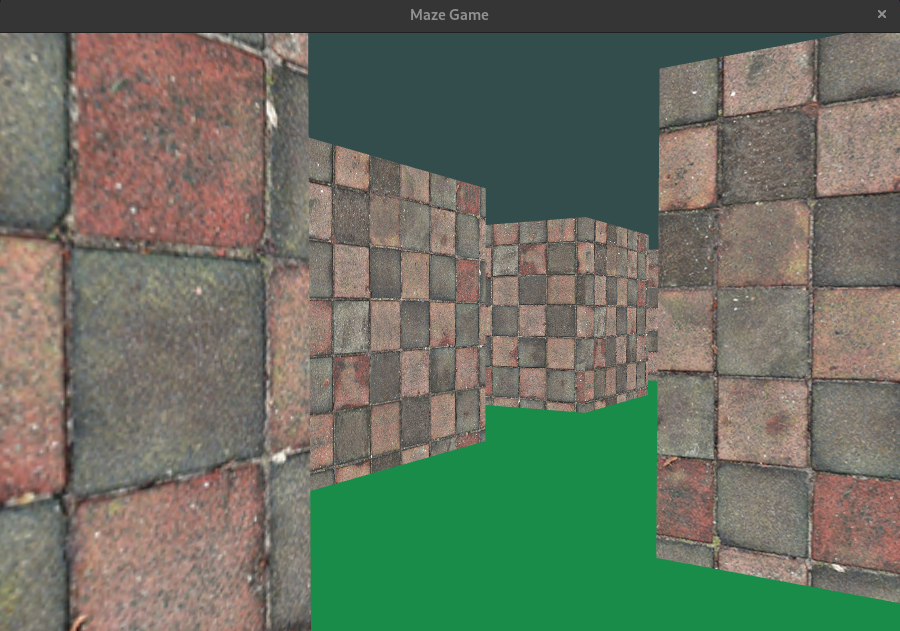

# Maze Game

This project is my small attempt to get my hands dirty with OpenGL :)

Huge thanks to [Learn OpenGL](https://learnopengl.com/)

## Build

This project requires [cmake](https://cmake.org/) and a C++ compiler.

To execute it, simply clone the project and run `make run`.

